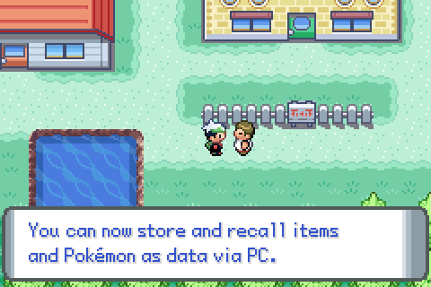
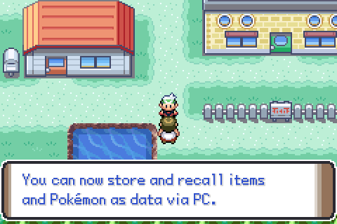

# Pokemon Gen 4 text boxes

Here are my ports of the Gen 4 text boxes to GBA. The sprites are taken from [here](https://www.spriters-resource.com/ds_dsi/pokemondiamondpearl/sheet/6962/) and reworked for GBA.

You are free to use them in your hack, just credit me. You may need to [make changes](https://github.com/Greenphx9/pokeemerald-expansion/blob/inflamed-red/src/menu.c#L90) to the field message window template, and you will need to [make changes](https://github.com/Greenphx9/pokeemerald-expansion/blob/inflamed-red/src/menu.c#L294) to the function that handles drawing.

## Screenshots

Diamond / Pearl (message_box.png):

Platinum (message_box_plat.png):

